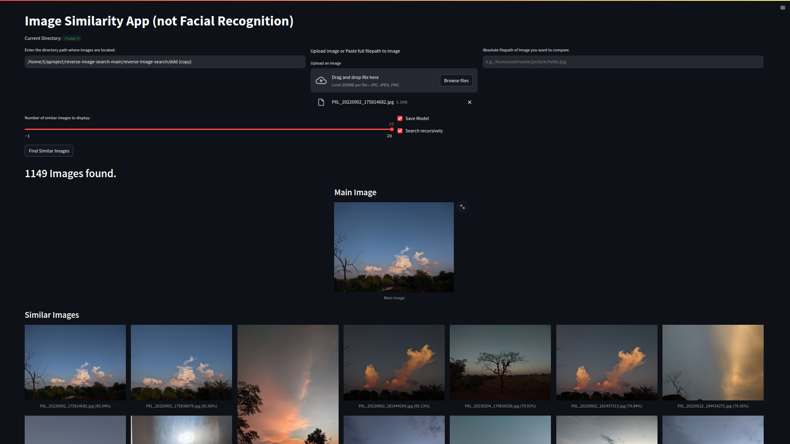

# Reverse Image Search Engine(Local)
This is a simple reverse image search engine that uses the Streamlit framework. It allows users to find similar images from a specified directory.

## Why is it helpful?
This tool can help identify similar images

## Installation
To use the reverse image search engine, simply follow these steps:

```
git clone https://github.com/tikendraw/reverse-image-search.git
pip install reverse-image-search-main/.
pip install -r reverse-image-search-main/requirements.txt

# Run the app
img_search
```
## Screenshot


## How to use
*  Provide the directory path where the images are located. You can either 

* Upload an image or paste the full file path of the image you want to compare.

* Number of similar Images to find. 

* Save Model (Optional): You can choose to save the model to speed up future searches if you plan to search in the same folder repeatedly. Enable the "Save Model" checkbox to save the model.

* Recursive Search (Optional): If you want to search for images recursively in child folders, enable the "Recursive" checkbox.

## Tech stack use
The reverse image search engine is built using the following technologies:

* Python
* Scikit-learn
* Tensorflow 
* Pillow
* NumPy
* Streamlit
  
## How to contribute
I wanted to add a **Facial recognition feature** for future updates.
If you would like to contribute to the reverse image search engine, please feel free to open a pull request.

## License
The reverse image search engine is licensed under the MIT License.

I hope this is helpful!


