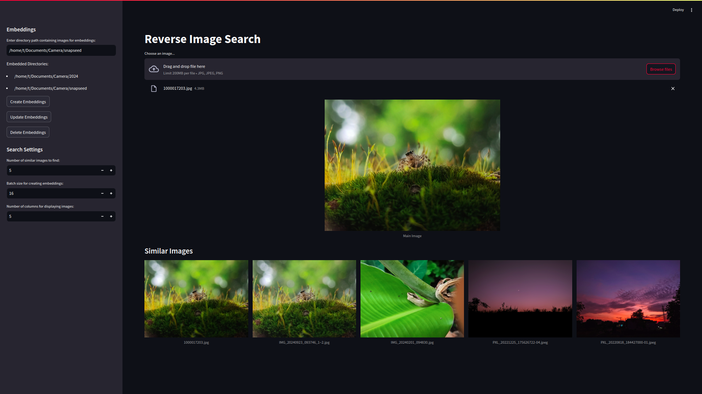
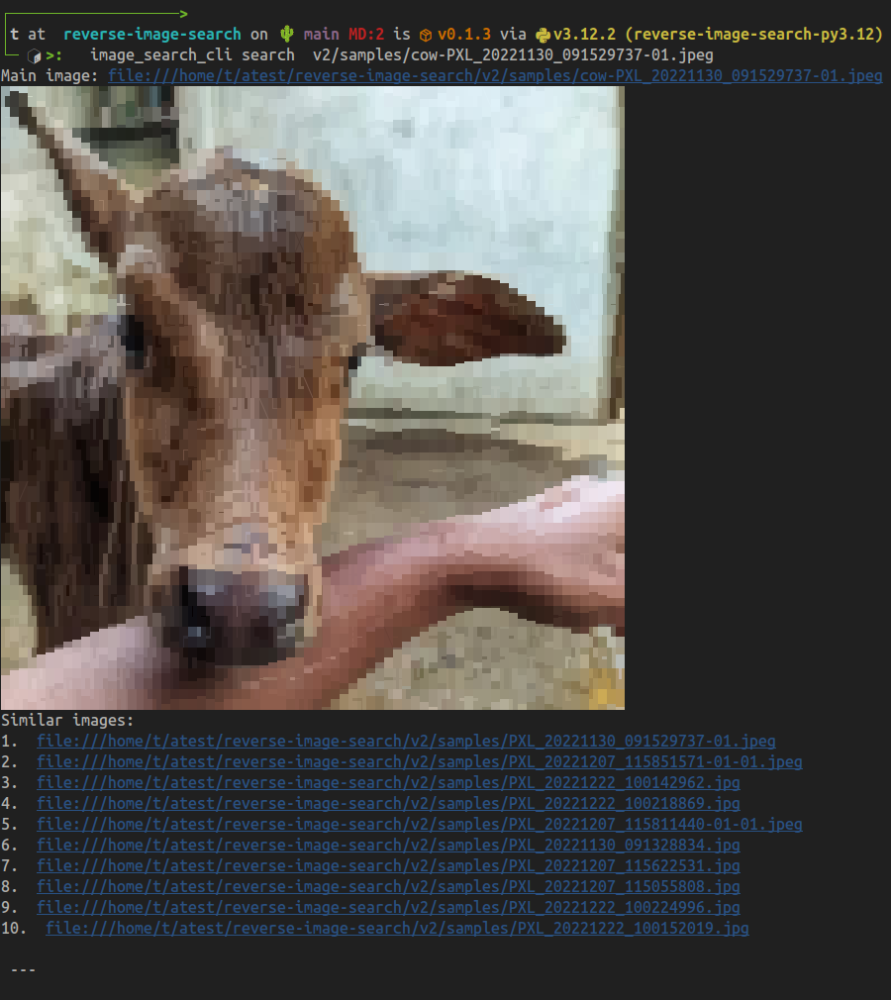

# Reverse Image Search Engine(Local)
This is a simple reverse image search tool that uses the Streamlit framework. It allows users to find similar images locally.

## Why is it helpful?
This tool can help identify similar images. This uses EfficientNet-B0 for vector embedding and Chromadb(vector database) for vector storage and retrieval. EfficientNet-B0 is a lightweight convolutional neural network architecture that is designed to be efficient and accurate for image recognition tasks. 

## Installation
To use the reverse image search engine, simply follow these steps:

```bash

# clone the repo
git clone https://github.com/tikendraw/reverse-image-search.git

# go inside
cd reverse-image-search

# install with pip
pip install . 

```

## Usage

1. Via browser
      bash command
      ```bash
      # bash command 
      image_search
      ```
      or just run the `launch.py` file
      ```bash
      python launch.py
      ```
2. Via command line

  * Embed a directory
    ```bash
    image_search_cli embed create -d <directory_path>
    ```
  * Search for similar images
    ```bash
    image_search_cli search <image_path> -n <num_similar_images>
    ``` 
  * Search for multiple images
    ```bash
    image_search_cli search <image_path1> <image_path2> <image_path3> ...
    ```
  * Update embeddings for a directory
    ```bash
    image_search_cli embed update -d <directory_path>
    ```
  * Delete embeddings for a directory
    ```bash
    image_search_cli embed delete -d <directory_path>
    ```
    > Use `delete_all_embeddings` string to delete all at once
  * Delete all embeddings
    ```bash
    image_search_cli embed delete -d delete_all_embeddings
    ```

## Screenshot
1. Web


2. CLI



## Tech stack use
The reverse image search engine is built using the following technologies:

* Python
* transformers 
* pytorch 
* EfficientNet-B0 for vector embedding
* Chromadb(vector database)
* Streamlit
* Pillow


## How to contribute
Future updates:

- [ ] Facial Recognition
- [ ] Search Images with words

If you would like to contribute to the reverse image search engine, please feel free to open a pull request.


## Citation
1. EfficientNet: Rethinking Model Scaling for Convolutional Neural Networks


```bibtex
@misc{tan2020efficientnetrethinkingmodelscaling,
      title={EfficientNet: Rethinking Model Scaling for Convolutional Neural Networks}, 
      author={Mingxing Tan and Quoc V. Le},
      year={2020},
      eprint={1905.11946},
      archivePrefix={arXiv},
      primaryClass={cs.LG},
      url={https://arxiv.org/abs/1905.11946}, 
}
```


## License
The reverse image search engine is licensed under the MIT License.

I hope this is helpful!


